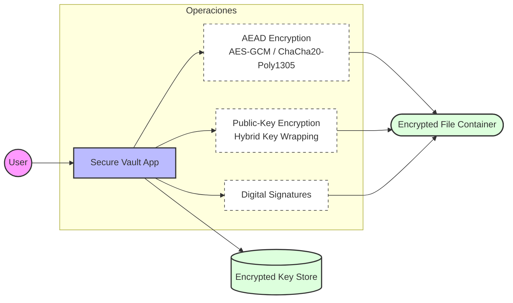

# SecurityVaultCryptography

**Secure system** for digital documents 

## Objectives

+ Protect 
+ Share
+ Verify

Applying cryptographic techniques 

## System Architecture Overview

```mermaid
graph LR
    %% Definición de Estilos
    classDef user fill:#f9f,stroke:#333,stroke-width:2px;
    classDef app fill:#bbf,stroke:#333,stroke-width:2px;
    classDef process fill:#fff,stroke:#333,stroke-dasharray: 5 5;
    classDef storage fill:#dfd,stroke:#333,stroke-width:2px;

    User((User)) --> App[Secure Vault App]

    subgraph Operaciones
        App --> AEAD[AEAD Encryption<br/>AES-GCM / ChaCha20-Poly1305]
        App --> PKI[Public-Key Encryption<br/>Hybrid Key Wrapping]
        App --> Sig[Digital Signatures]
    end

    App --> KeyStore[(Encrypted Key Store)]
    
    AEAD --> Container([Encrypted File Container])
    PKI --> Container
    Sig --> Container

    %% Aplicar clases
    class User user;
    class App app;
    class AEAD,PKI,Sig process;
    class Container,KeyStore storage;
```
