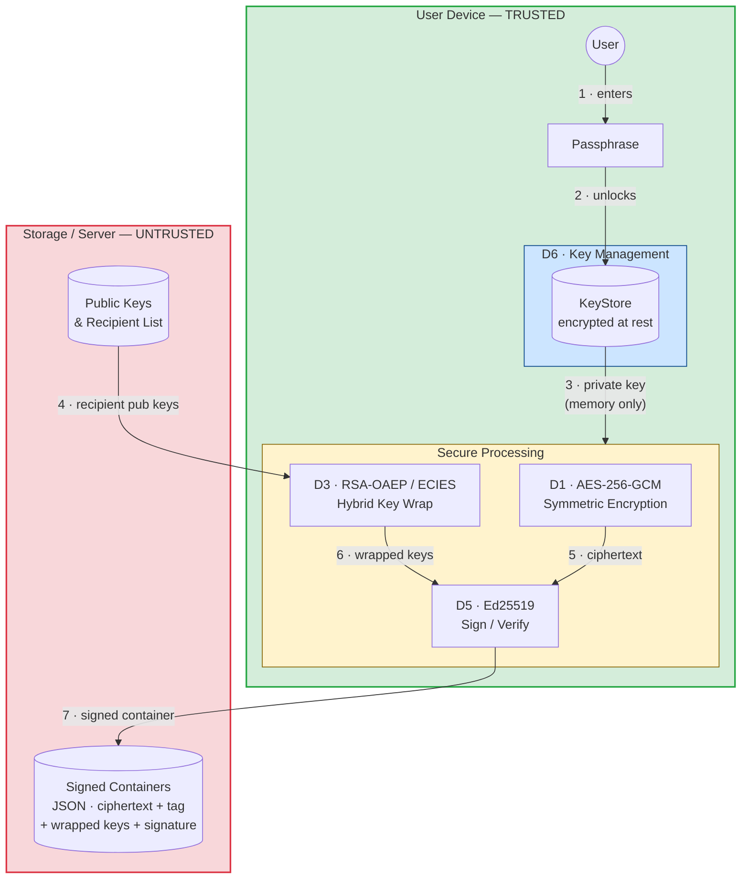
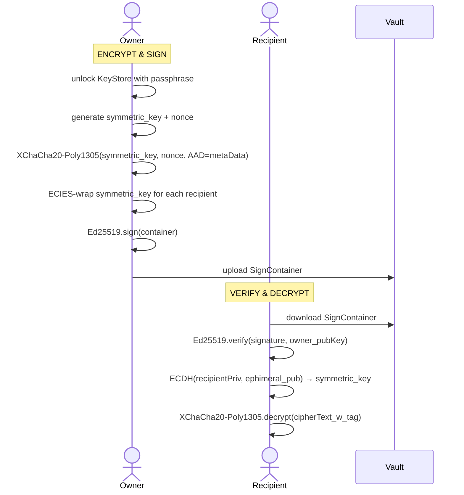

# SecurityVaultCryptography

> A layered cryptographic vault for secure document storage and sharing — built from scratch using modern primitives.

---

## What does it solve?

Traditional storage solutions have a single point of failure: compromise one account and all data is exposed. This vault breaks that model by separating keys from ciphertext. An attacker who steals the encrypted file gets nothing without the private key. An attacker who steals the private key gets nothing without the encrypted file.

```
attacker gets encrypted file  →  useless without key
attacker gets private key     →  useless without encrypted file
both together                 →  still blocked by digital signature verification
```

---

## Deliverables

| ID  | Name                 | Stack               | Description                                    |
| --- | -------------------- | ------------------- | ---------------------------------------------- |
| D1  | Symmetric Encryption | Python / TypeScript | AES-256-GCM / XChaCha20-Poly1305 AEAD          |
| D3  | Hybrid Encryption    | Python / TypeScript | RSA-OAEP + ECIES-style multi-recipient sharing |
| D5  | Digital Signatures   | TypeScript          | Ed25519 sign/verify, ECIES key encapsulation   |
| D6  | Key Management       | Python / TypeScript | PBKDF2 / Scrypt + AES-GCM protected keystores  |

Each deliverable has its own `README` inside its folder with full design decisions, test descriptions, and security discussion.

---

## System Architecture



---

## Encryption Stack

```
┌─────────────────────────────────────────────────┐
│  D5 · DIGITAL SIGNATURE                         │
│  Ed25519 · signs the complete container         │
├─────────────────────────────────────────────────┤
│  D3 · KEY DISTRIBUTION (per recipient)          │
│  RSA-OAEP (D3-Python) · ECIES/X25519 (D5/D6-TS)│
│  wraps the file key once per authorized user    │
├─────────────────────────────────────────────────┤
│  D1 · FILE ENCRYPTION                           │
│  XChaCha20-Poly1305 (AEAD)                      │
│  encrypts the file exactly once                 │
│  metadata / recipient list used as AAD          │
├─────────────────────────────────────────────────┤
│  D6 · KEY PROTECTION                            │
│  PBKDF2-SHA256 (TS) · Scrypt (Python)           │
│  protects private keys at rest with passphrase  │
└─────────────────────────────────────────────────┘
```

---

## Container Format

Every encrypted file is stored as a self-contained JSON object that can be shared over any channel:

```jsonc
{
  "metaData": {
    "filename":          "report.pdf",
    "file_type":         "application/pdf",
    "timestamp":         "2026-01-01T00:00:00Z",
    "owner_fingerprint": "<SHA-256 of owner public key>",
    "encryption":        { "cipher": "XChacha20-Poly1305", ... },
    "keyWrapping":       { "scheme": "ECIES-STYLE", ... },
    "ownerWrap":         { "wrapNonce": "...", "wrappedKey": "...", "ephimeral_pub": "..." }
  },
  "recipients": [
    { "username": "alice", "wrapNonce": "...", "wrappedKey": "...", "ephimeral_pub": "..." },
    { "username": "bob",   "wrapNonce": "...", "wrappedKey": "...", "ephimeral_pub": "..." }
  ],
  "cipherText_w_tag": "<XChaCha20-Poly1305 ciphertext + 16-byte Poly1305 tag>",
  "signature_algo":  "Ed25519",
  "signer_id":       "juan",
  "signature":       "<Ed25519 signature over the full container>"
}
```

---

## Encryption + Decryption Flow



---

## Security Properties

| Property                            | Mechanism                    | Where enforced    |
| ----------------------------------- | ---------------------------- | ----------------- |
| **Confidentiality**                 | XChaCha20-Poly1305 AEAD      | D1 / D3 / D5      |
| **Integrity**                       | Poly1305 authentication tag  | D1 / D3 / D5      |
| **Authenticity**                    | Ed25519 digital signature    | D5                |
| **Access control**                  | Per-recipient ECIES key wrap | D3 / D5 / D6      |
| **Key protection at rest**          | PBKDF2 / Scrypt + AEAD       | D6                |
| **Metadata tamper-detection**       | AAD in AEAD                  | D1 / D3 / D5      |
| **Recipient list tamper-detection** | AAD + signed container       | D3 / D5 / D6      |
| **Canonicalization**                | `fast-json-stable-stringify` | D1 / D3 / D5 / D6 |

---

## Threat Model

### Assets protected

- Encrypted file contents
- Private keys (stored encrypted in KeyStore)
- Recipient list and file metadata

### Adversary assumptions

| Adversary                      | Capability                          | System response                                     |
| ------------------------------ | ----------------------------------- | --------------------------------------------------- |
| Attacker with storage access   | Reads encrypted containers          | Ciphertext is useless without private key           |
| Attacker with stolen container | Modifies metadata or recipient list | Poly1305 tag or Ed25519 signature fails             |
| Attacker with stolen KeyStore  | Tries to extract private key        | Blocked by PBKDF2/Scrypt — requires passphrase      |
| Unauthorized recipient         | Tries to decrypt                    | No valid `wrappedKey` entry → decryption impossible |
| Impersonator                   | Crafts a fake container             | Signature fails without owner's private key         |

### Out of scope

- Compromised operating system with active memory access
- Weak passphrases chosen by the user
- Network interception (transport security is assumed)

---

## Design Constraints

| Security Requirement | Design Constraint                               | Primitive used                       |
| -------------------- | ----------------------------------------------- | ------------------------------------ |
| Integrity            | Any 1-bit change must be detected               | AEAD authentication tag (Poly1305)   |
| Authenticity         | Documents must be linked to an identity         | Ed25519 digital signature            |
| Confidentiality      | Decryption impossible without authorized key    | XChaCha20-Poly1305 + ECIES key wrap  |
| Key protection       | Private keys never stored in plaintext          | PBKDF2 / Scrypt + XChaCha20-Poly1305 |
| Multi-recipient      | One file, many authorized readers               | Per-recipient ECIES key wrap         |
| Metadata integrity   | Parameters and recipient list cannot be swapped | Metadata included as AAD             |

---

## Cryptographic Primitives

| Algorithm                 | Role                                    | Reference           |
| ------------------------- | --------------------------------------- | ------------------- |
| XChaCha20-Poly1305        | Authenticated file encryption           | RFC 8439            |
| AES-256-GCM               | Key storage encryption (D6 Python)      | NIST SP 800-38D     |
| RSA-OAEP / SHA-256        | Key wrapping (D3 Python)                | RFC 8017            |
| X25519 + HKDF-SHA256      | ECIES key encapsulation (D5/D6 TS)      | RFC 7748 + RFC 5869 |
| Ed25519                   | Digital signatures                      | RFC 8032            |
| PBKDF2-SHA256 (600k iter) | Key derivation from passphrase (TS)     | NIST SP 800-132     |
| Scrypt (N=2¹⁷)            | Key derivation from passphrase (Python) | RFC 7914            |
| SHA-256                   | Public key fingerprints                 | FIPS 180-4          |

---

## Repository Structure

```
SecurityVaultCryptography/
├── README.md               ← this file
├── docs-site/              ← generated documentation
├── python-extra/           ← Python utility scripts and demos
└── entregables/
    ├── D1/                 ← Symmetric encryption (Python + TS)
    ├── D3/                 ← Hybrid multi-recipient encryption
    ├── D5/                 ← Digital signatures + ECIES key encapsulation
    └── D6/                 ← Key management and secure keystores
```

---

## Running the Tests

**TypeScript (Vitest):**

```bash
cd entregables/<Dx>
npm install
npm test
```

**Python (pytest):**

```bash
cd entregables/<Dx>
pip install cryptography pytest
pytest -v
```
