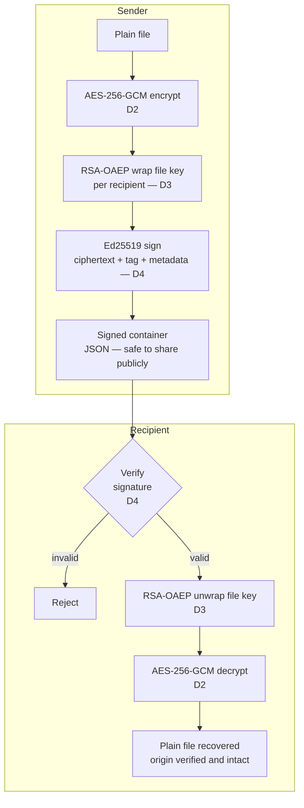

# SecurityVaultCryptography

A secure digital document vault that protects files using encryption and digital signatures. Only authorized recipients can decrypt the content, and every file carries a cryptographic proof of who created it.

---

## System flow diagram



The signed container holds everything needed: the ciphertext, the nonce, the authentication tag, the metadata, the per-recipient encrypted keys, and now also the signature and the signer's fingerprint. None of that reveals the original file content, the container is safe to transmit over any channel.

---

## What was added in D4 — Digital Signatures

### The new file

`signature_module.py` lives in `Secure_Signature_Module/` and adds two classes.

`SignatureManager` handles all signature operations. It generates Ed25519 key pairs, serializes them to PKCS#8 PEM format (the same standard used for RSA keys in D3), and computes a SHA-256 fingerprint of every public key to identify signers. When signing, it builds a canonical payload from the ciphertext, the tag, and the metadata, then signs it with the sender's private key. When verifying, it checks the fingerprint first, then verifies the signature cryptographically.

`SignedHybridEncryption` is the unified entry point that combines everything. Its `encrypt_and_sign` method runs the D3 encryption and then immediately signs the result. Its `verify_and_decrypt` method verifies the signature first and only proceeds to decryption if the signature is valid. If verification fails for any reason, the file is rejected before any decryption attempt happens.

---

## Why Ed25519?

Three reasons. First, it does not need a random number during signing. ECDSA requires a secret random value called `k` for every signature, if `k` is ever reused or predictable, the private key is exposed. Ed25519 does not have this problem. Second, it produces very short signatures: 64 bytes regardless of message size. Third, it was designed from the start to resist timing attacks, which makes it safer to use in practice without needing extra precautions.

RSA-PSS and ECDSA would also have worked, but Ed25519 is simpler, faster, and removes an entire class of implementation risks.

---

## What data is signed and why

The signature covers three things: the ciphertext, the authentication tag, and the metadata. These are serialized together as JSON with sorted keys to make sure the payload is always identical byte-for-byte regardless of how the container was assembled.

The ciphertext is included because it is the actual protected content. If it changes, the signature breaks. The tag is included because it is AES-GCM's own integrity guarantee signing it binds the signature to that specific encryption. The metadata is included because it contains the recipient list, the algorithm identifiers, the filename, and the timestamp. If an attacker changes any of that information, the signature breaks before decryption even starts.

The `recipients` list (which holds the per-person encrypted key entries) is not part of the signed payload directly, but the `recipients_ids` field inside the metadata which contains the fingerprint of every recipient's key — is signed. This means an attacker cannot add or remove a recipient without invalidating the signature.

---

## Why sign the ciphertext and not the plaintext?

The plaintext does not travel in the container at all, it is encrypted and replaced by the ciphertext. But more importantly, signing the plaintext would create a vulnerability: an attacker could take a legitimate signed plaintext, re-encrypt it with a different key or for different recipients, and the original signature would still appear valid over the plain content. Signing the ciphertext ties the signature to this specific encryption, with this specific key, for these specific recipients.

---

## Why must verification happen before decryption?

If decryption runs first, the system is already trusting the container before checking whether it came from the right person. An attacker could craft a malicious container that causes errors during decryption, potentially leaking information through error messages or timing. Verifying first means the container is authenticated before any cryptographic operations run on it.

---

## How signers are identified

Every signed container stores two fields: `signer_id`, which is a human-readable name like "alice", and `signer_fingerprint`, which is a SHA-256 hash of the signer's public key in DER format. When verifying, the system computes the fingerprint of the public key it was given and compares it against the stored one. If they do not match, verification is rejected immediately — before any cryptographic check even runs. This prevents identity confusion where someone provides a valid public key that does not belong to the expected signer.

---

## Updated container format

```
{
  metadata          — algorithm info, filename, timestamp, recipients_ids
  recipients        — [ { id, key_fingerprint, encrypted_key }, ... ]
  nonce             — random 96-bit value for AES-GCM
  ciphertext        — the encrypted file content
  tag               — AES-GCM authentication tag (16 bytes)
  signature         — Ed25519 signature in hex (64 bytes)
  signer_id         — human-readable name of the signer
  signer_fingerprint — SHA-256 of the signer's public key
}
```

---

## Tests

**test_firma_valida** confirms that a correctly signed and encrypted file passes verification and decrypts to match the original content byte for byte.

**test_ciphertext_modificado** confirms that flipping a single bit in the ciphertext invalidates the signature. The modification is detected before any decryption attempt.

**test_metadata_modificada_firma** confirms that changing any field in the metadata, even just the filename, invalidates the signature, since the metadata is part of the signed payload.

**test_llave_publica_incorrecta** confirms that using a different public key to verify (one whose fingerprint does not match the stored signer fingerprint) is rejected immediately.

**test_firma_eliminada** confirms that if the `signature` field is removed from the container, the system raises an error before doing anything else. An attacker cannot bypass verification by simply deleting the signature.

---
