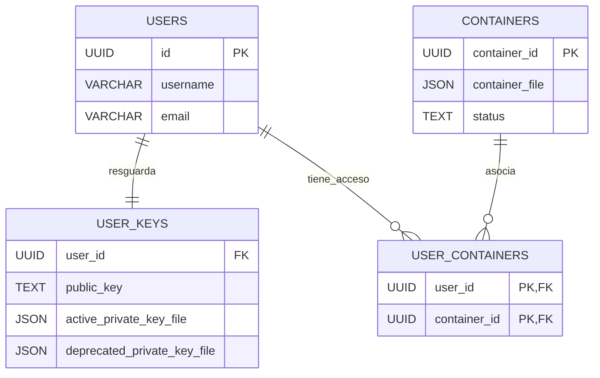

# D6 — Key Management

## This adds to and builds upon the features provided by D5

## Module Description

1. **Programming Language**: TypeScript
    - **JS dependencies**:
  ```json
  "dependencies": {
    "@noble/ciphers": "^2.2.0",
    "@noble/curves": "^2.2.0",
    "@noble/hashes": "^2.2.0",
    "fast-json-stable-stringify": "^2.1.0",
    "zod": "^4.4.3"
  }
  ```
2. **Execution environment**: Web page FrontEnd

## Goal

Design and implement a secure key managment system for your vault.

# Test Environment

This module uses **Vitest** for testing. Follow these steps to set up the environment and try the module yourself on your machine:

1. **Prerequisites**: You must have install Node.js and npm

2. **Environmente Setup**: Download the contents of this module (source code and configuration files). Once inside the module's root directory, install the required dependencies:


```bash
npm install
```

3. **Execute the Tests**: The test are define inside the ./test folder. To launche the test suite, run the following commands in your terminal:

```bash
npm test
```
### Main Tests executed:

+ Correct password -> access granted
+ Wrong password -> acces denied
+ Modified keystore -> failure

## Updates (Last version in ../D5)

Previously, the public key pair was exported in PEM format using the corresponding structure (PKCS#8 or SPKI). For this delivery, a JSON format was created to export the key pair in one file.

### Key Storage Format
```json
{
  "metadata": {
    "key_type": "Ed25519",
    "generated_at": ISO 8601 string,
  },
  "kdf_parameters":{
    "algorithm": "PBKDF2",
    "hash": "SHA-256",
    "iterations": 524288,
    "key_length_bytes": 32,
  },
  "privateKey_encryption": {
    "algorithm": "XChacha20+Poly1305",
    "tag_size_bytes": 16,
  },
  "salt": Base64 string,
  "nonce": Base64 string,
  "public_key": Base64 string,
  "encryptedPrivateKey_w_tag": Base64 string,
}
```
One advantage of using the Ed25519 algorithm to generate the key pair is that the public key can be derived from the private key. However, it was decided to also include the public key in the exported private key file for convenience and to avoid performing the calculations.

The purpose of this file is to serve as a cryptographic container for securely safeguarding the private key. A key-wrapping scheme was implemented using XChaCha20-Poly1305 together with PBKDF2, allowing a password to be used for encryption.

## Public Key Life Cycle

1. **Generation**
2. **Usage**
3. **Rotation**: It refers to key rotation (updating from an old key to a new one). This may occur either because a defined expiration period has been reached or because the keys have been compromised. In any case, there are two scenarios:
    + **Containers in which one is the owner**: The strategy is to completely rebuild all the user's containers using the new credentials. This full regeneration is mandatory because, if the previous keys were compromised, an attacker could not only decrypt the contents but also modify the container and generate a false signature to make it appear authentic.
    + **Containers in which one is the recipient**: the strategy is to issue a key-update request for the associated containers rather than rebuilding them completely. If an attacker compromises a user's key pair, they might have already extracted the symmetric key of one or more containers, allowing them to decrypt the current payload. However, this is functionally equivalent to the attacker having simply stolen the plaintext files. Since the containers are immutable—meaning any modification to the contents requires the owner to rebuild the container with a new symmetric key—the attacker cannot alter the data or inflict further damage. The critical aspect of this solution is speed: the compromised user must send the key-update request as soon as possible to prevent the attacker from gaining access to other containers.

## Details

### KDF selection and parameters

PBKDF2 was chosen due to its robustness and adaptability to the project’s requirements. Although the cryptographic library @noble supports Argon2, the latter is a memory-intensive algorithm and may place excessive demands on client hardware. PBKDF2 provides strong resistance while maintaining predictable and lightweight resource consumption.

**Parameters**:
+ **password**
+ **salt** (16 rambom bytes) :  Its purpose is to ensure that if two users use the same password, their resulting keys are completely different.
+ **iterations** (524288): Determines how many times a cryptographic hash function is repeatedly applied to a password and salt.
+ **hash** (SHA-256) : It determines the mathematical rules governing how the password and the salt are combined during each iteration.
+ **key_length_bytes**: Size of the output bytes array.

### BackUp strategy

This is application logic, not module logic.

This goes far beyond a normal backup, it has to do with Key Rotation.

The next strategies requiere a database structure similar to the one below:



>The server cannot automate anything due to the encryption model in use; the user must be aware of and explicitly validate any changes.

**Key rotation for containers in which one is the owner**: When initiating a key rotation, a user may own multiple cryptographic containers. Because rebuilding each container is a resource-intensive process that requires explicit user authorization via their password, the system manages pending updates through a reconstruction queue. To ensure security without operational overhead, the database maintains a maximum of two key states: one active and one deprecated. When a rotation is authorized, the active keys shift to the deprecated slot, new active keys are generated, and all current containers are marked as "obsolete" and added to the queue for background rebuilding.

To prevent catastrophic data loss, a strict safety lock blocks any subsequent key rotations until the rebuild queue is completely cleared. If a consecutive rotation were permitted before processing the existing queue, the current deprecated keys would be permanently overwritten, resulting in the irreversible loss of access to any container still waiting to be rebuilt.

**Key rotations for containers in which one is the recipient**: Unlike container owners, recipients lack the cryptographic authority to modify a container directly. To address this, the system implements an event-driven notification architecture for recipient key rotations. Immediately after a recipient successfully rotates their key pair, their client automatically generates and dispatches key-update requests to the respective owners of all shared containers. These requests are securely queued on the owners' side as pending access updates, acting as notifications that prompt the owner to re-wrap the symmetric file key using the recipient's newly generated public key.


### Security Assumptions

+ For the development of our application, we intend to remove the responsibility of key management from users—that is, the idea is for users not to download or handle key files or containers directly. Instead, everything is stored on the server. This remains secure because the decryption keys themselves are never stored.
+ The user’s computer is assumed not to be infected with malware capable of reading its RAM memory.
+ If a key or container file were ever to be compromised, the responsibility would lie on the server side. Although the server itself cannot do much under the current encryption model, it could still issue alerts requesting a key rotation.

## Security Discussion

## Why encrypt private key?

The private key is your absolute root of trust. If stored in plaintext, a database leak would allow an attacker to instantly decrypt all your shared containers and forge your identity by signing malicious files . Encrypting it at rest ensures that identity and data security remain intact even if the storage server is completely compromised.

## What happens if a password is weak?

Since a weak password has very few combinations, the attacker can systematically guess it within a reasonable timeframe, validate the AEAD tag, and fully extract the private key.

## What are your system limitations?

1. **Strict Two-Key Concurrency Cap (The Safety Lock)**: Because the database is planned to store a maximum of two key states (active_private_key_file and deprecated_private_key_file), a user cannot trigger consecutive key rotations. If a user tries to rotate their keys a second time while they still have containers marked as "obsolete" in their rebuild queue, the system must block the operation. Allowing it would overwrite the current deprecated slot, causing catastrophic, irreversible data loss for all containers waiting to be rebuilt.

2. **Event-Driven Asynchronous Recipient Updates (Lazy Revocation)**: When a recipient rotates their keys, they cannot update the shared containers themselves because they lack owner-level write permissions. The system relies on sending a notification/request to the owner. This creates a window of vulnerability: until the owner logs in, authorizes the request, and re-wraps the key, an attacker possessing the recipient's old compromised key can continue to decrypt the static contents of those containers.

3. **Client-Side Computational Overhead**: To honor the Zero-Trust paradigm, all encryption, decryption, and key derivation happen strictly on the client side (the browser or local runtime) so the central database never sees plaintext data. However, if a user owns a large number ($N$) of containers, processing the rebuild queue requires computing the 524k-iteration PBKDF2 matrix and re-wrapping multiple keys sequentially. This heavy cryptographic workload can temporarily spike CPU usage and lag or freeze single-threaded JavaScript environments.

## **Container Structure**

```json
{
  "metaData": {
    "file_type": MIME TYPES,
    "filename": string,
    "timestamp": ISO 8601 string,
    "owner_fingerprint": Base64 string,
    "ownerWrap":{
        wrapNonce,
        wrappedKey,
        ephimeral_pub,
    },
    "encryption": {
      "cipher": "XChacha20-Poly1305",
      "key_size_bits": "256",
      "nonce_size_bits": "192",
      "tag_size_bits": "128"
    },
    "keyWrapping": {
      "scheme": "ECIES-STYLE",
      "asymmetric": {
        "curve": "X255519",
        "kdf": {
          "alg": "HKDF",
          "hash": "SHA-256"
        }
      },
      "symmetric": {
        "cipher": "XChaCha20",
        "key_size_bits": 256
      }
    },
    "recipients": KeyWrap[],
    "nonce": Base64 string
  },
  "cipherText_w_tag": Base64 string,
  "signature_alg": "Ed25519",
  "signer_id": string,
  "signature": Base64 string
}
```

> KeyWrap
```json
{
    "username": string,
    "wrapNonce": Base64 string,
    "wrappedKey": Base64 string,
    "ephimeral_pub": Base64 string,
}
```
